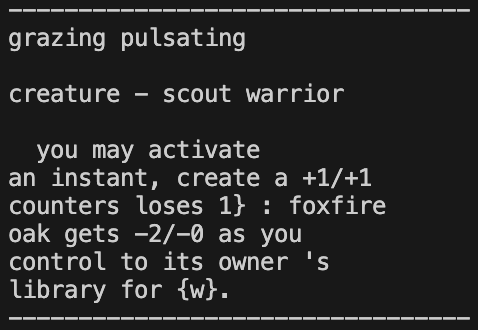
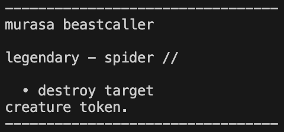
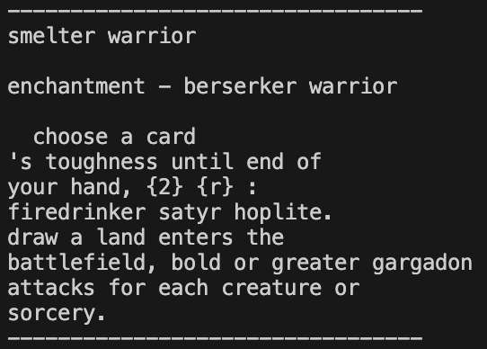
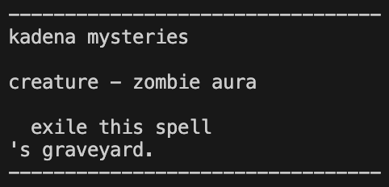

# Magic-Card-Generator
Text generator trained on Magic: the Gathering cards.  
  
### Acknowledgements
Nicolas Tedeschi: Taught me about different language models in LIGN 165 at UCSD. I used the implementations of a Bag of Words model and Bigram Model from his class  
  
### Examples
A General Card  
  
A Green Card  
  
A Red Card  
  
A Blue Card  
  